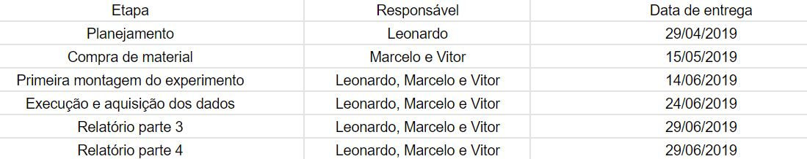
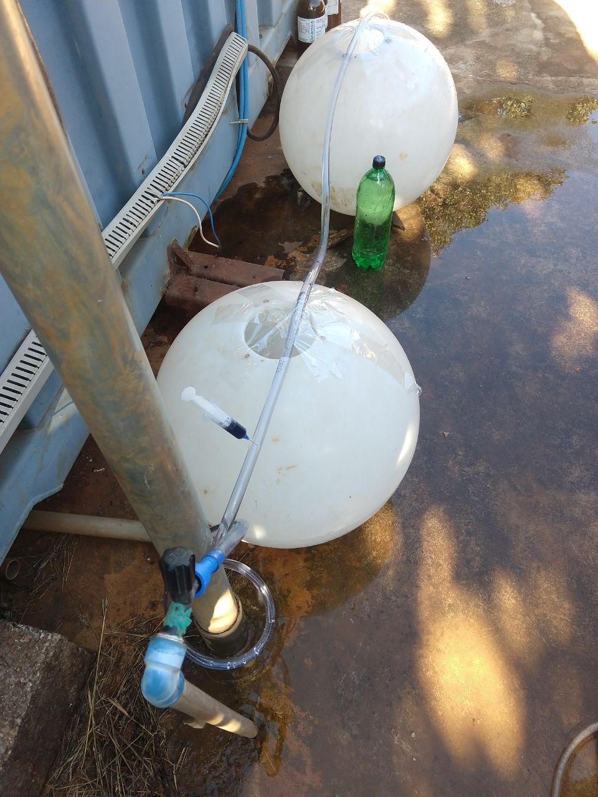
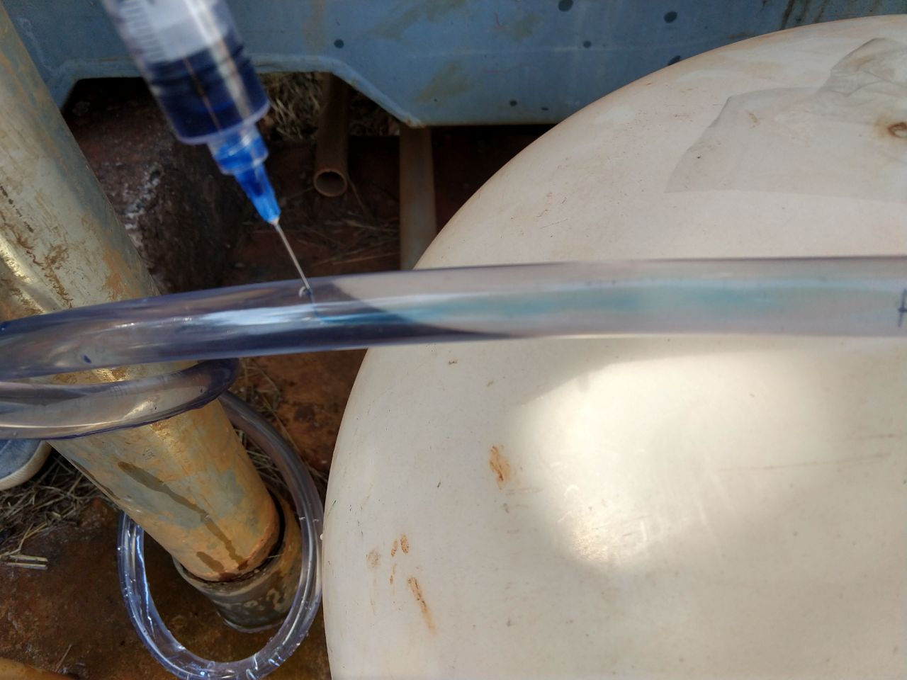
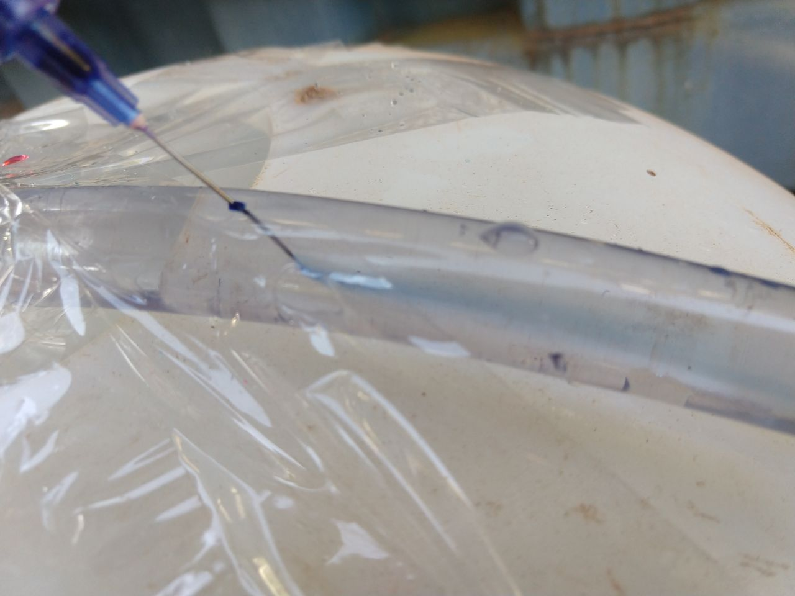
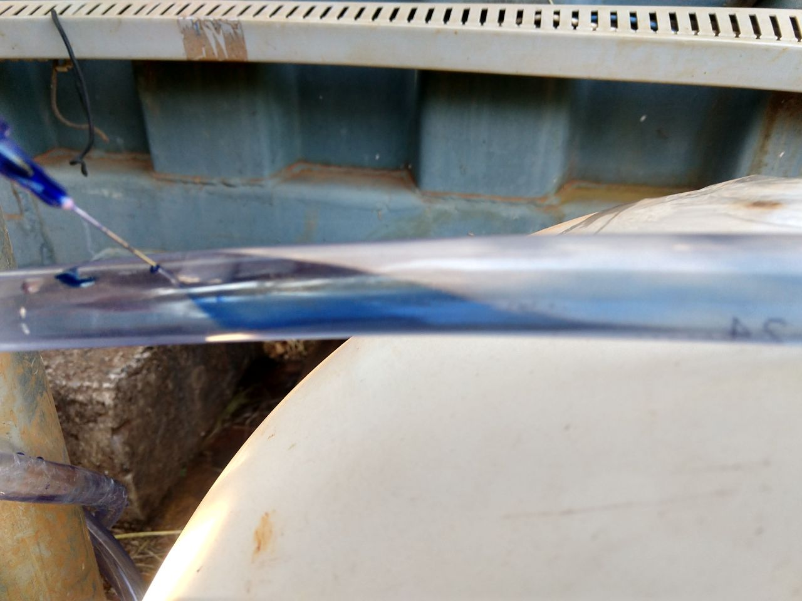
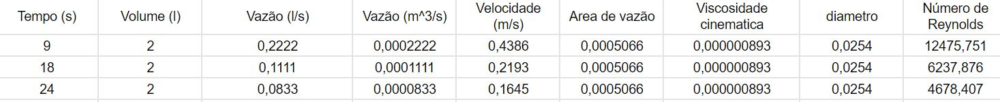
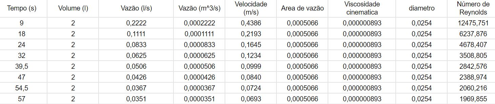

Grupo 11:

### Integrantes do Grupo 
- Marcelo Lucas Couto Gomes - 16/0135508
- Leonardo Julio Chagas Souza - 13/0143413
- Vitor Umpierre Marinho - 15/0175850

### 1.	Início:

  ### 1.1 Tema Escolhido:
  - Turbulência em Fluidos

  ### 1.2 Objetivo do experimento:
  Este experimento tem como objetivo verificar as velocidades de vazão para uma situação determinada para que o fluído seja turbulento, e a partir dos dados de vazão coletados.
  
  ### 1.3 Escopo do experimento:
  Será trabalhado um fluído newtoniano, neste caso a água, onde será variado a velocidade da água em uma mangueira transparente e com uma seringa será injentado no fluído uma água com corante onde será possível verificar visualmente a turbulência no fluído.
  
  # Nota: 2,5

### 2.	Planejamento e Preparação:

  ### 2.1 Teoria do experimento:
  O número, ou coeficiente de Reynolds, é uma relação entre forças de inercia e forças de viscosidade que define o comportamento de um fluído newtoniano em três: Turbolento, transitório e laminar. Introduzido por Stokes em 1851, o número é definido pela relação matemática:
   
   
   
   onde:
   -  u é a velocidade;
   -   é a massa específica do fluído;
   -  d é a diâmetro de fluxo no tubo;
   -   é a viscosidade dinâmica do fluído;
   
 A partir dos resultados medidos no experimento original foi possível chegar nas seguintes conclusões:
  - Para valores menores que 2000, regime laminar;
  - Para valores entre 2000 e 2400, regime transitório;
  - Para valores maiores que 2400, regime turbolento.
  
 Tratando de um experimento em que: a massa específica, o diâmetro de fluxo no tubo e viscosidade dinâmica serão constante é possível concluir que a variação a velocidade é um causa importante para comparar o comportamento de um mesmo fluído, ou seja, nesse caso a variação de velocidade é única variável do sistema.

  ### 2.2 Procedimentos experimentais:
  
   - Materiais:
      - Torneira com controle de vazão;
      - Mangueira transparente 2 metros;
      - Corante de água;
      - Seringa;
      - Balde 10 litros;
     
   - Procedimentos:
   1. A mangueira será conectada na torneira em uma ponta e sua vazão seria direcionada para o balde.
   2. A seringa com água com corante se conecta ao balde;
   3. Ao ligar a torneira o cronômetro será disparado.
   4. Apos iniciar a vazão será esperado 10 segundos para começar a injentar a agua com corante no sistema
   5. Ao injentar a água será tirado fotografias do regime encontrado no fluído, para tal vazão
   6. Ao encher o balde de 10 litros o cronometro será parado.
  
  - Planejamento de execução;
  
  O experimetno passará por três etapas antes da finalização do relatório:
  1. Planejamento e alinhamento
  2. Compra de materiais
  3. Montagem e execução
  
  apos essas três etapas o relatório será concluído conforme as instruções do trabalho.
  
  - Cronograma de execução
    
   
  
  ### 2.2 Aquisição de dados:
  
  Nesse experimento será adquirido apenas o dado da vazão pelo experimento a partir da variação do tempo para encher um volume de terminado. A partir da vazão será possível calcular a velocidade do fluído pela relação:
  
  ;
  
  onde:
  
   - u é a velocidade;
   - Q é a vazão medida;
   - A é área de vazão;
  
  e com isso chegar no valores do número de Reynolds a partir considerando os dados tabelados da água para o fluído.
  
  ### 2.3 Resultados esperados:
  
  Como os valores de Reynolds já foram calculados os resultados esperados serão definidos com os valores descrito na em 2.1:
  - Para valores menores que 2000, regime laminar;
  - Para valores entre 2000 e 2400, regime transitório;
  - Para valores maiores que 2400, regime turbolento.
  
  # Nota: 2,0
  
# - Erros de digitação 

### 3.	Execução:

  ### 3.1	Divisão de tarefas:

 ;
 Devido a conflitos de agenda por questão de matérias, eventos e saúde o cronograma de execução foi modificado pra a execução desse experimento seguindo a nova agenda de data determinada acima.
 
 ### 3.2	Procedimentos:
 
 O experimento foi executado no Campus Gama próximo aos containers, devido a localização algumas modificações foram executados para a montagem do experimento.
 
 ;
 
 - A mangueira foi conectada no torneira e foi utilizado dois suporte, onde a mangueira foi presa com fita adesiva nos dois suporte, a seringa com a agua com corante foi conectada um pouco antes do suporte, pois como suporte é branco permitiu ver melhor o comportamento do fluído, o balde de 10 litros foi substituido por uma garrafa de 2 litros, para verificar a velocidade em que o sistema liberava os 2 litros.
 
  ### 3.3	Dados:
  
  Os dados aferidos nesse experimento foram o tempo para encher a garrafa de 2 litros e para cada tempo foram tiradas fotografias do comportamento do fluído. Os tempos medidos foram 9 segundos, 18 segundos e 24 segundos.
  
  - Regime em 9 segundos;
  
  ;
  
  - Regime em 18 segundos;
  
  ;
  
  - Regime em 24 segundos.
  
  ;
  
# Nota: 2,0

# erros de formatação
  
### 4.	Análise e conclusão:

  ### 4.1	Cálculos e Resultados;
  
  Para realizar os cálculos desses experimento foi criado uma planilha no excel, utilizandos os seguintes valores constantes:
  - Área de vazão;
  - Diâmetro da mangueira;
  - Viscosidade Cinemática;
  - Volume;
  fixando esse valores foi possível chegar no valores de número de Reyonolds experimental para os tempos medidos, sendo todos acima de 2000, confirmando o turbulência do fluído calculado observada nas 3.3.
  
  ;
  
  Como o número de Reynolds é uma relação linear sendo a varíavel o velocidade do flúido, foi possível projetar a partir de qual velocidade o fluído sairia do regime turbolento para um regime transiente.
  
  ;
  
  Com isso possível verificar que com a velocidade de 0,0693 m/s o regime passa a ser turbulento, infelizmente essa velocidade não é possível chegar no ambiente em que foi feito o experimento.
  
  ### 4.3 Conclusão;
  
  Esse experimento é uma forma bem didática de trabalhar com número de Reynolds em ambientes em que o controle não é alto. Durante a execução foi possível chegar em resultados plauísveis seguindo a base teórica dada na máteria de dinâmica de fluídos. Sendo assim, o experimento se torna aconselhável para demonstração da relação do número de Reyonolds e turbulência.

#  Nota: 1,5

#  Erros de digitação
#  Análise pobre dos resultados

