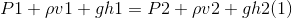
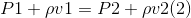
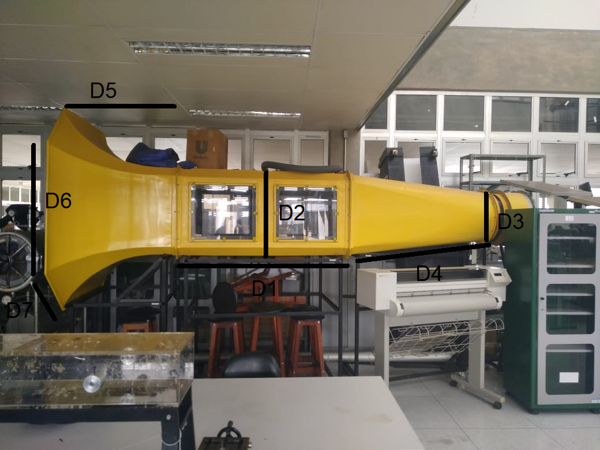
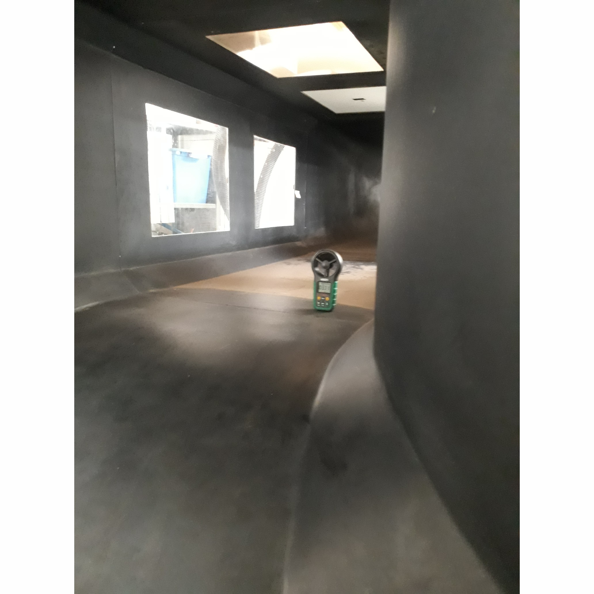

Grupo 13:
- Bruno Ramos Ribeiro - 17/0007369
- Vinicius Hiroshi Souza Miwa - 17/0046753

### 1.	Início:

#### 1.1. Tema:

Efeito de Bernoulli.

#### 1.2 Objetivo:
	
Verificar experimentalmente a equação de Bernoulli.

#### 1.3 Escopo:

Tarefas minímas para a realização do experimento:
1. Estudar o funcionamento do túnel de vento;
2. Estudar calibração de sensores;
3. Obter um anemômetro.

# Nota: 2,0

# - Objetivo e Escopo incompletos
   
### 2.	Planejamento e Preparação:

#### 2.1. Princípio de Bernoulli:

O físico Daaniel Bernoulli propôs o seguinte enunciado como princípio para escoamento de fluidos: "Se a velocidade de uma partícula de um fluido aumenta enquanto ela se escoa ao longo de uma linha de corrente, a pressão do fluido diminui e vice-versa"

Um dos principais motivos para o vôo aviônico é o princípio de Bernoulli, se considerarmos a asa de um avião, como a parte de cima é maior que a parte de baixo, as partículas de ar passarão por um percurso maior no mesmo tempo em comparação com embaixo da asa, criando uma pressão menor em cima já que a velocidade é maior, aparecendo uma forma de sustentação.

O princípio de Bernoulli diz que dentro de um fluxo de fluido horizontal, pontos de velocidade de fluido mais alta terão menos pressão que pontos de velocidade de fluido mais baixa.  

A equação de Bernoulli é, em sua essência, uma forma mais geral e matemática do princípio de Bernoulli que também leva em consideração variações na energia potencial gravitacional. 

A equação de Bernoulli relaciona a pressão, a velocidade e a altura de quaisquer dois pontos (1 e 2) em um fluxo constante de fluido de densidade . A equação de Bernoulli é normalmente escrita da seguinte forma:

Sendo:

P1 = Pressão inicial;

 = Densidade do ar dentro do túnel;

v1 = Velocidade dentro do túnel;

h1 = Altura inicial;

P2 = Pressão final;

 = Densidade do ar na saída do túnel;

v2 = Velocidade na saída do túnel;

h2 = Altura final;

Vale lembrar que para a utilização da Equação de Bernoulli é necessário que o fluido tenha:
* Viscosidade = 0;
* Vazão = constante;
* Fluxo incompressível;
* Fluxo irrotacional.

#### 2.2.  Procedimentos:

Os túneis de vento são equipamentos utilizados para a simulação de comportamentos aerodinâmicos, se trata de um túnel com a passagem contínua de ar, neles são testados, por exemplo, a aerodinâmica de carros e aviões. Neste experimento, o túnel de vento será utilizado como meio para provar o princípio de Bernoulli, para isso, a velocidade e a pressão do ar serão monitoradas dentro e na saída do túnel, tendo esses resultados poderemos substituir os mesmos na equação de Bernoulli, validando-a.

Tem-se como premissa que não há variação da altura, logo sabe-se que os componentes que dependem da mesma será zero, sendo assim, pode-se reescrever a equação:

Foi planejado que todos os membros do grupo vão ajudar na execução do experimento, caso apenas um membro possa ser responsável por está tarefa, a mesma será dada ao Bruno Ramos Ribeiro. Estima-se que o tempo necessário para a execução seja algo em torno de uma hora. Como o prazo para a execução experimento seja em menos de uma aula, espera-se o término do mesmo de uma a duas semanas, dependedo apenas da disponibilidade do laboratório.

Passo a passo para a realização do experimento:
1. Verificar os sensores que estão no túnel de vento;
2. Verificar a calibração dos sensores;
3. Anexar sensores no túnel de vento caso esse não tenha todos os necessários;
4. Medir velocidade do vento fora do túnel com a utilização de um anemômetro;
5. Pressão fora do túnel será considerada a pressão atmosférica;
6. Medir velocidade do vento dentro do túnel de vento com um anemômetro;
7. Medir a pressão dentro do túnel de vento com um barômetro; 
8. A densidade do fluido de trabalho será considerada constante.

Após a obtenção dos dados, será feita a comparação com resultados teóricos e experimentais.

#### 2.3. Resultados Esperados:

Espera-se que dentro do túnel de vento a velocidade do ar seja maior que do lado de fora, a pressão, por sua vez, será menor do lado de dentro e maior do lado de fora, de forma mais exata, ao substuir oa valores na equação de Bernoulli espera-se os dois lados da igualdade com o mesmo resultado numérico.

# Nota: 2,5

### 3.	Execução:

#### 3.1 Instrumentos:

Anemômetro: consiste num instrumento para medir a velocidade do vento ou de outros fluidos em movimento.

Túnel de vento:  estrutura que propicia a simulação do comportamento do ar em relação a diversos tipos de objetos, como aviões, carros e até mesmo na construção civil.

Trena:  serve para medições lineares.

#### 3.2 Procedimento: 

1. Realizar medições da estrutura do túnel de vento.

2. Posicionar o anemômetro dentro do túnel de vento para se obter a velocidade do vento. A medição com o anemômetro é realizada três vezes. Observação: não foi necessário a calibração do anemômetro pois esse já estava calibrado.

3. Medir a velocidade do vento fora do túnel de vento.

4. Medir pressão fora do túnel de vento. 

Foi possível a presença da dupla na realização do experimento, acarretando na mútua cooperação dos integrantes no procedimento experimental. 

#### 3.3 Dados:

Túnel de vento:

Figura 1: Túnel de vento

Onde:

D1: 1508  0.5 mm.

D2: 843  0.5 mm.

D3: 580  0.5 mm. 

D4: 1914  0.5 mm.

D5: 942  0.5 mm.

D6: 945  0.5 mm.

D7: 440  0.5 mm.

Velocidade do vento no interior do túnel: 3.68  0.01 m/s; 3.60  0.01 m/s; 3.75  0.01 m/s.

Velocidade fora do túnel de vento: a uma distância de três metros do bocal do túnel, a velocidade do vento foi de 0 m/s.

Pressão fora do túnel de vento: a uma distância de três metros do bocal do túnel, a pressão foi de 1 atm ou 101325 Pa.

#### 3.4 Montagem experimental:

  Figura 2: Anemômetro no interior do túnel de vento

 
### 4.	Análise e conclusão:
#### 4.1 Resultados
	
Tendo as velocidades do vento no interior do túnel: 3.68  0.01 m/s; 3.60  0.01 m/s; 3.75  0.01 m/s. Pode-se encontrar os seguintes dados:

Média aritmética das velocidades: 3,68  0.005 m/s.

Desvio padrão:  0,06 m/s.

Logo tem-se que o erro total é  0,075 m/s, dessa forma tem-se que a velocidade média mais o erro é 3,68  0.075 m/s.

Aplicando a formula de Bernoulli:

P1 = ?;

 = 1,184 kg/m^3;

v1 = 3,68 m/s;

P2 = 101325 Pa;

v2 = 0 m/s;

A densidade do ar dentro do túnel (1) é igual a densidade do ar fora do túnel (2). Considerou-se a temperatura de 25°C constante nos dois pontos.

A variação da altura dentro é 0, já que a altura dentro do túnel (h1) e fora dele (h2) são iguais, assim como a densidade () e a gravidade (g), dessa forma, ao subtrair os termos correspondentes o resultado é zero, sendo assim, pode-se desconsiderar ambos.

O valor de P1 encontrado ao utilizar a fórmula de Bernoulli foi de 101308,97 Pa

#### 4.2 Discussão

Considerando dois pontos, ponto A e ponto B, ambos na mesma altura e com densidade do fluido constante. De acordo com a fórmula de Bernoulli, se no ponto A o fluido escoa em uma velocidade maior do que no ponto B, a pressão no ponto A deve ser menor do que no ponto B. O valor de P1 encontrado condiz com a teoria.

#### 4.3 Conclusão

O objetivo inicial de verificar a fórmula de Bernoulli não foi atingido porque a dupla não conseguiu obter um barômetro. Assim não foi possivel medir a pressão dentro do túnel. Se tivesse sido obtido o valor da pressão dentro do túnel através de medição, teria como descobrir a velocidade pela fórmula de Bernoulli e comparar com o valor da velocidade obtido pela medição com o anemômetro.
A solução foi encontrar a pressão dentro do túnel através de Bernoulli e ver se o resultado ia de encontro com o que a teoria diz. O resultado foi condizente com a formula, pois a velocidade de escoamento do fluido dentro do túnel de vento foi maior do que a do lado de fora, porém a pressão do lado de fora foi maior do que a do interior do túnel.
	
