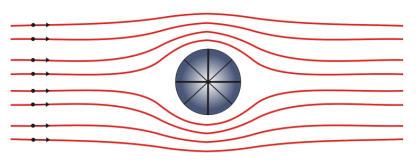
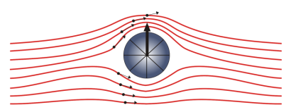
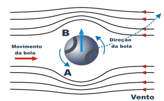
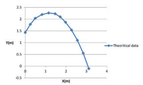
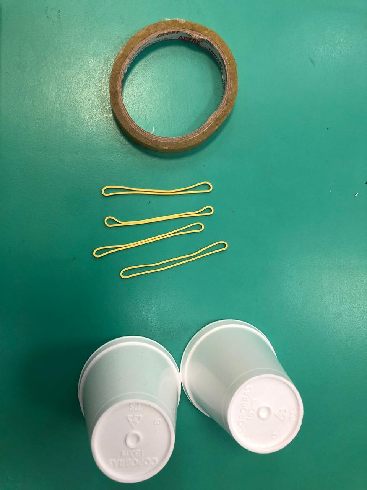
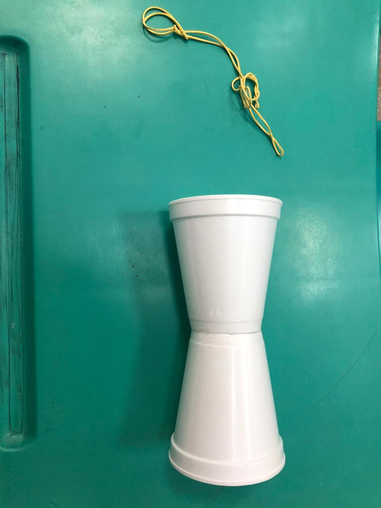
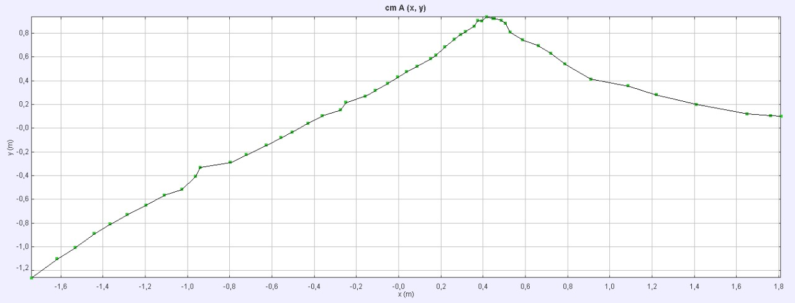

Grupo 14:
- Derick Fernando Oliveira Fernandes - 16/0117780
- Rodrigo Ribeiro da Cunha Fernandes - 16/0144132
- Charles Henrique dos Santos Fernandes e Fernandes - 17/0057097

### Laboratório de Dinâmica dos Fluidos - 2019.1  

### 1.	Início:   

### Tema: 

Efeito Magnus.   

### Objetivo:

Verificar as consequências do efeito Magnus na trajetória de um corpo submerso na atmosfera.   

### Escopo:

O Efeito Magnus é um efeito físico que pode ser percebido no cotidiano como, por exemplo, nas atividades esportivas. Trata-se de um fenômeno hidrodinâmico descoberto pelo químico e físico alemão Heinrich Gustav Magnus pelo qual a trajetória em um fluido (líquido ou gás) de um objeto é alterada devido à sua rotação. Este efeito tem grande interesse pratico, desde o projeto dos aviões até o “efeito” que é dado à bola por um jogador de futebol. Para entender este princípio, é necessário conhecer o comportamento dos fluidos em seu escoamento em torno de objetos. Se um cilindro é introduzido num campo de escoamento inicialmente uniforme, as linhas da corrente em torno do cilindro tem o aspecto como indicado na Figura 1. A velocidade do fluido é nula nos extremos de seu diâmetro horizontal e máxima nos extremos de seu diâmetro vertical, passando por valores intermediários para diâmetros que tenham outra orientação.   

 
**Figura 1.** Escoamento de fluido em torno de um cilindro em repouso.   

Para o escoamento em torno de um cilindro em rotação, temos a seguinte representação:   

 
**Figura 2.** Escoamento de fluido em torno de um cilindro em rotação.   

Observa-se que as linhas de corrente estão mais próximas na parte superior do cilindro. Nessa região a velocidade do escoamento é maior, e de acordo com o teorema de Bernoulli (1738): “em toda corrente de água ou de ar a pressão será grande quando a velocidade for pequena e, ao contrário, a pressão será pequena quando a velocidade for grande”.   

A partir dessa lei é explicado o Efeito Magnus, pois como a pressão na parte de cima do cilindro é menor em relação à parte de baixo (e consequentemente à pressão atmosférica), o objeto tende a desviar sua trajetória também para cima. Um exemplo: na figura 3, uma bola com “spin” (rotação) é lançada contra o vento. A figura ilustra a rotação anti-horária. A rotação faz com que uma camada de ar grudada à superfície gire com a bola. Isto faz com que em B, esta camada aumente a velocidade do vento e em A, ela seja diminuída. Logo, de acordo com Lei de Bernoulli, a pressão em A sendo maior do que em B, surge uma força, chamada empuxo dinâmico, que desvia a trajetória original da bola. Se invertermos o sentido da rotação, inverte-se também o sentido do empuxo.   

 
**Figura 3.** Esquema de forças de uma bola em rotação pelo ar.   

O empuxo dinâmico resultante da combinação de um escoamento uniforme com uma circulação também é responsável pela sustentação dos aviões, gerando um “upforce” (força para cima, sustentação). Já nos carros de fórmula 1 a mesma força é responsável pela “downforce” (força para baixo), que pressiona os carros contra a pista.   

### 2.	Planejamento e Preparação:

A confecção material do experimento é simples, são necessários apenas alguns elementos e poucas horas para a montagem e reprodução do mesmo, a parte mais trabalhosa está relacionada à instrumentação necessária  para  acompanhar a trajetória dos corpos de prova após lançados e aos softwares que à avaliarão de modo a obter dados necessários para análise experimental.   

### Materiais:

Os materiais essenciais para a realização para o ensaio experimental são:  

* 2 copos pequenos de isopor;
* 2 copos médios de isopor;
* Uma fita adesiva com boa aderência;
* Fitas elástica em látex;
* Lampada de led na cor vermelha;
* Pilhas 3V;
* Uma câmera fotográfica digital;
* Tripé para câmera fotográfica;
* Cabos de transferências de dados;
* Um computador para processamentos dos dados coletados;
* Software “tracker”.   

### Montagem:

A montagem do experimento se dará  nas seguintes etapas:   

* Confecção dos planadores (corpos de prova) com copos de mesma medida unidos em sua base com fita adesiva;
* Implantação de um led (com seus terminais unidos à pilha) no interior de um dos copos;
* Confecção do instrumento responsável pela impulsão dos planadores;
* Instalação da câmera fotográfica sobre o tripé em ambiente de boa iluminação, livre de correntes de ar e obstáculos e a acomodação da mesma de modo perpendicular à trajetória prevista ao planador após lançado.   

A confecção de todo aparato será de responsabilidade do aluno Derick Fernando -160117780 com auxilio dos demais integrantes.   

### Cronograma:

Será estabelecido o seguinte cronograma para a montagem e execução do projeto:   

* 11/05/2019 - Compra do material necessário para montagem dos elementos materiais;
* 16/05/2019 - Montagem dos corpos de provas e instrumento de impulsão;
* 18/05/2019 - Execução do experimento;
* 27/05/2019 - Entrega dos Outputs obtidos a partir da análises dos dados experimentais;
* 08/06/2019 -Entrega da Análise dos dados experimentais obtidos com os dados teóricos estimados.  

### Dados que serão obtidos:

O experimento busca detectar a trajetória do planador com o efeito Magnus, traçando um gráfico no plano xy, e em seguida comparando com o gráfico traçado a partir da função obtida por cálculos analíticos.   

### Resultados esperados:

Após a realização do experimento espera-se por meio da análise das imagens obtidas obter uma trajetória de voo do planador aproximada com a trajetória teórica obtidas por cálculo analítico.   

 
**Figura 4.** Trajetória de voo obtida por cálculos analíticos.   

### 3.	Execução:

A execução do experimento foi realizada dentro da sala S9 da Faculdade UnB-Gama. Estavam presentes todos os 3 integrantes do grupo. Os integrantes Dérick Fernando Oliveira e Charles Henrique dos Santos foram responsáveis pela montagem e lançamento do planador de Magnus, enquanto o integrante Rodrigo Ribeiro responsabilisou-se pela filmagem.   

### Procedimentos:

 

Utilizando 2 copos de isopor e uma fita adesiva, o planador é construído e elásticos que dão a força inicial para a sua navegação são enrolados em volta de sua garganta.    

 

Características do planador:   

* Volume do planador: 0,480 m³;
* Peso do planador: 5g;
* Diâmetros mínimo e máximo: 5cm e 8cm.   

Parâmetros que impactam a trajetória:   

* Peso: Se o peso do planador for muito alto, a força de sustentação será menor;
* Velocidade inicial: Se a velocidade inicial for baixa, a aceleração será menor;
* Material do planador: Muda o atrito entre o ar e o planador;
* Velocidade angular: Muda as forças que atuam sobre o planador.   

O planador, então, é segurado no ar com seus elásticos esticados. A câmera começa a filmar e o planador é solto no ar, empurrado pela força elástica, realizando uma trajetória não-parabólica.   

Utilizando a filmagem produzida, é feito um gráfico da trajetória do planador de Magnus por meio do programa Tracker.

 

### 4.	Análise e conclusão:
